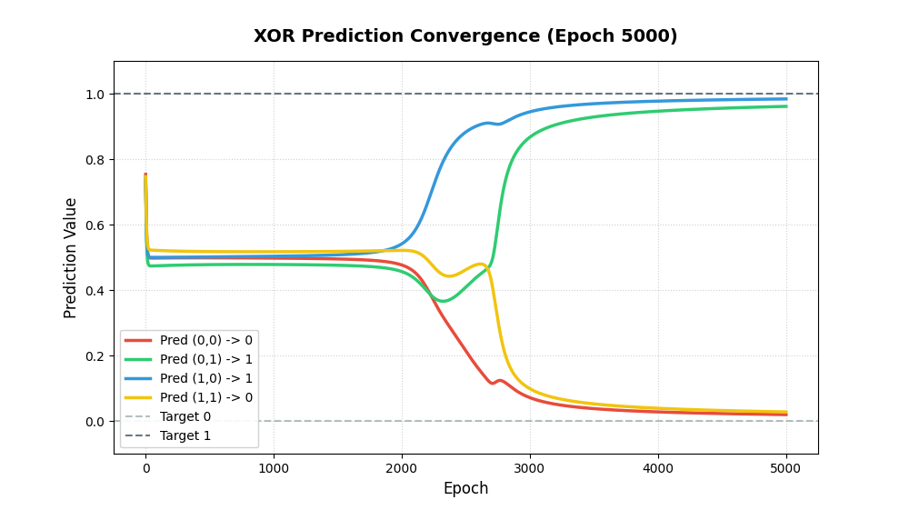
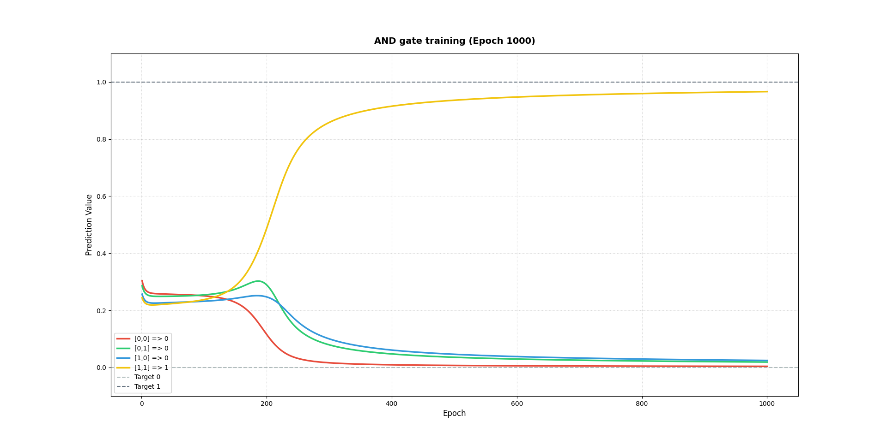
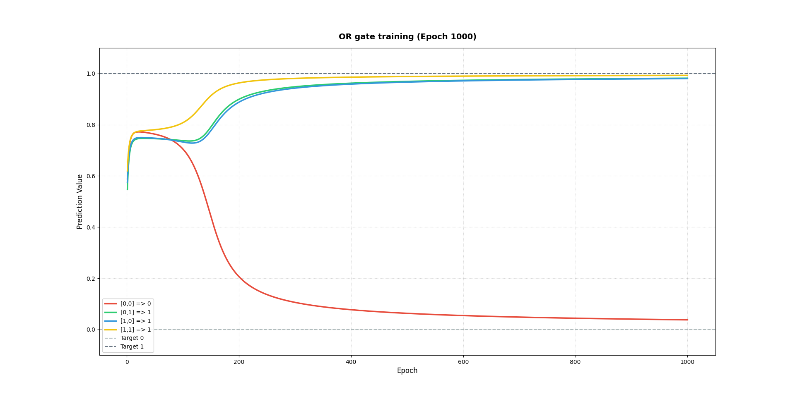

# 🧠 MiniFramework: Neural Networks from Scratch

A lightweight, dependency-free (except for optional visualization) neural network framework built entirely from scratch in Python, combined with comparative modern deep learning implementations in PyTorch. This library demonstrates the core mathematics, forward propagation, backpropagation, and optimization mechanics that power modern deep learning.

---

## 🚀 Key Features

* **Custom Autograd-like Backpropagation**: Mathematically correct, layer-by-layer backpropagation (`backward`) and parameter update (`update`) routines for weights and biases.
* **Modular OOP Design**: Highly clean [Neuron](file:///home/shaikafnan/MiniFramework/lib/neuron.py#L10), [NeuralLayer](file:///home/shaikafnan/MiniFramework/lib/neuron.py#L38), and [NeuralNetwork](file:///home/shaikafnan/MiniFramework/lib/neuron.py#L56) classes that permit arbitrary layers, node sizes, and activations.
* **Vector Math Library**: A completely custom, zero-dependency linear algebra module [vectors.py](file:///home/shaikafnan/MiniFramework/lib/vectors.py) handling dot products, scalar multiplication, and matrix multiplication.
* **Multiple Activations**: [sigmoid](file:///home/shaikafnan/MiniFramework/lib/activation.py#L3), [relu](file:///home/shaikafnan/MiniFramework/lib/activation.py#L6), and [tanh](file:///home/shaikafnan/MiniFramework/lib/activation.py#L15) functions, coupled with their respective dynamic analytical derivatives.
* **Live Training Visualizer**: Real-time rendering of predictions converging to target outputs over training epochs using `matplotlib`.
* **PyTorch Comparative Suite**: Deep learning implementations (Feedforward and Convolutional networks) in PyTorch to compare scratch-built models with industry standards.

---

## 📈 Live Gate Training Convergence

The live training visualizer demonstrates coordinates converging gracefully and completely to their binary targets over the epochs.

### XOR Gate Convergence (5000 Epochs, lr=0.5)
Solving the non-linear XOR logic gate requires multi-layer decision boundaries:


### AND Gate Convergence (1000 Epochs, lr=1.0)


### OR Gate Convergence (1000 Epochs, lr=1.0)


---

## 🛠️ Repository Architecture

The codebase is organized into highly focused folders:

```text
├── lib/
│   ├── __init__.py         # Exposes core API classes/functions
│   ├── activation.py       # Sigmoid, ReLU & Tanh activations + derivatives
│   ├── loss.py             # Mean Squared Error (MSE) loss and gradients
│   ├── vectors.py          # Zero-dependency Vector & Matrix Math engine
│   ├── neuron.py           # Core classes: Neuron, NeuralLayer, and NeuralNetwork
│   └── test/
│       ├── __init__.py
│       └── test.ipynb      # Interactive activation function visualization
├── main/
│   ├── __init__.py
│   ├── and.py              # AND gate solver with live matplotlib visualization
│   ├── or.py               # OR gate solver with live matplotlib visualization
│   ├── xor.py              # XOR gate solver with live matplotlib visualization
│   └── pytorch/            # PyTorch reference implementations
│       ├── fnn/
│       │   ├── __init__.py
│       │   └── test.ipynb  # PyTorch Feedforward NN for coordinate/math fitting
│       └── cnn/
│           ├── __init__.py
│           ├── cnn.ipynb   # Custom PyTorch CNN for image classification
│           ├── data/       # Dataset folder for training
│           └── tuned_cnn.ipynb # Transfer learning with fine-tuned ResNet-18
├── test/
│   ├── __init__.py
│   └── test.py             # Verification and unit testing script (scratch math)
├── sample/                 # Output training visualization PNG plots
└── metadata/               # Mathematical details and documentation files
    └── markdown/
        ├── activation.md
        ├── neuron.md
        └── vectors.md
```

### 1. Vector Math ([vectors.py](file:///home/shaikafnan/MiniFramework/lib/vectors.py))

Provides custom mathematical operations on Python lists, bypassing standard external libraries like NumPy:

* `dot(v1, v2)`: Computes $\vec{v}_1 \cdot \vec{v}_2 = \sum x_i y_i$. See [dot](file:///home/shaikafnan/MiniFramework/lib/vectors.py#L20).
* `mat_mul(m1, m2)`: Computes matrix-matrix products. See [mat_mul](file:///home/shaikafnan/MiniFramework/lib/vectors.py#L36).
* `add(v1, v2)` / `sub(v1, v2)`: Element-wise list addition and subtraction.

### 2. Activations ([activation.py](file:///home/shaikafnan/MiniFramework/lib/activation.py))

Encapsulates activation functions and their derivatives, critical for scaling gradients backward:

* **Sigmoid**: $f(x) = \frac{1}{1 + e^{-x}}$ with derivative $f'(x) = f(x)(1 - f(x))$. See [sigmoid](file:///home/shaikafnan/MiniFramework/lib/activation.py#L3).
* **ReLU**: $f(x) = \max(0, x)$ with derivative $f'(x) = 1 \text{ if } x > 0 \text{ else } 0$. See [relu](file:///home/shaikafnan/MiniFramework/lib/activation.py#L6).
* **Tanh**: $f(x) = \tanh(x) = \frac{e^x - e^{-x}}{e^x + e^{-x}}$ with derivative $f'(x) = 1 - \tanh^2(x)$. See [tanh](file:///home/shaikafnan/MiniFramework/lib/activation.py#L15).

### 3. Core Framework ([neuron.py](file:///home/shaikafnan/MiniFramework/lib/neuron.py))

* **[Neuron](file:///home/shaikafnan/MiniFramework/lib/neuron.py#L10)**: Manages weights, bias, activation type, stored inputs, pre-activations ($z$), outputs, and errors. Dynamically updates itself using standard gradient descent:
  $$w_i \leftarrow w_i - \eta \cdot \delta \cdot x_i$$
  $$b \leftarrow b - \eta \cdot \delta$$
* **[NeuralLayer](file:///home/shaikafnan/MiniFramework/lib/neuron.py#L38)**: Manages collections of neurons, supports optional custom weights, and handles forward parameter copy safety (preventing shared reference bugs).
* **[NeuralNetwork](file:///home/shaikafnan/MiniFramework/lib/neuron.py#L56)**: Coordinates forward pass, backward pass (calculating output and backpropagating hidden errors $\delta$), parameter updates, and interactive graphing.

### 4. PyTorch Suite ([pytorch](file:///home/shaikafnan/MiniFramework/main/pytorch))

For performance and architecture comparisons, the repository includes modern deep learning notebooks implemented in PyTorch:
* **Feedforward Neural Network ([fnn/test.ipynb](file:///home/shaikafnan/MiniFramework/main/pytorch/fnn/test.ipynb))**: A coordinate and multiplication solver model using two hidden layers (`Linear(2, 32) -> Tanh() -> Linear(32, 16) -> Tanh() -> Linear(16, 1)`). It learns coordinate-based mathematical relationships far better than standard ReLU models due to smooth `Tanh` curvature.
* **Custom CNN ([cnn/cnn.ipynb](file:///home/shaikafnan/MiniFramework/main/pytorch/cnn/cnn.ipynb))**: A deep convolutional network with three convolutional blocks (`Conv2d -> ReLU -> MaxPool2d`) mapping features to fully connected layers for image classification.
* **ResNet-18 Transfer Learning ([cnn/tuned_cnn.ipynb](file:///home/shaikafnan/MiniFramework/main/pytorch/cnn/tuned_cnn.ipynb))**: Utilizes a pre-trained `resnet18` backbone, freezing all weights except the customized classification layer (`fc = nn.Linear(512, 10)`), demonstrating production-grade training processes.

---

## 📖 Getting Started & Usage

### Running the Custom Verification Test
Ensure that the framework's mathematical equations are working correctly by executing the test suite:
```bash
python test/test.py
```

### Running the XOR Solver
To run the scratch-built XOR dataset solver and view the live convergence animation, execute:
```bash
python main/xor.py
```

### Building Your Own Network from Scratch

You can assemble and train your own sequential network in just a few lines of code:

```python
from lib import NeuralNetwork, NeuralLayer, sigmoid

# 1. Instantiate network
nn = NeuralNetwork()

# 2. Add layers sequentially (Input size 2, Hidden layer 4, Output layer 1)
nn.add(NeuralLayer(num_neurons=4, layer_size=2, a_type=sigmoid))
nn.add(NeuralLayer(num_neurons=1, layer_size=4, a_type=sigmoid))

# 3. Forward Pass
pred = nn.forward([1.0, 0.5])
print("Prediction:", pred)

# 4. Backward Pass (Target: [1.0])
nn.backward([1.0])

# 5. Gradient Step (Learning Rate: 0.1)
nn.update(0.1)
```

---

## 📐 Mathematical Formulation of Backpropagation

Our framework implements the exact multi-layer backpropagation formulas:

1. **Output Layer Error Term ($\delta_i^L$):**
   $$\delta_i^L = (a_i^L - y_i) \cdot f'(z_i^L)$$
2. **Hidden Layer Error Term ($\delta_j^l$):**
   For hidden layer $l$, error propagates back from the downstream layer $l+1$:
   $$\delta_j^l = \left( \sum_k \delta_k^{l+1} \cdot w_{kj}^{l+1} \right) \cdot f'(z_j^l)$$
3. **Weight and Bias Updates:**
   $$\Delta w_{ij}^l = -\eta \cdot \delta_i^l \cdot a_j^{l-1}$$
   $$\Delta b_i^l = -\eta \cdot \delta_i^l$$
