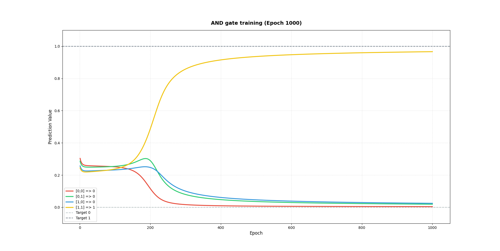
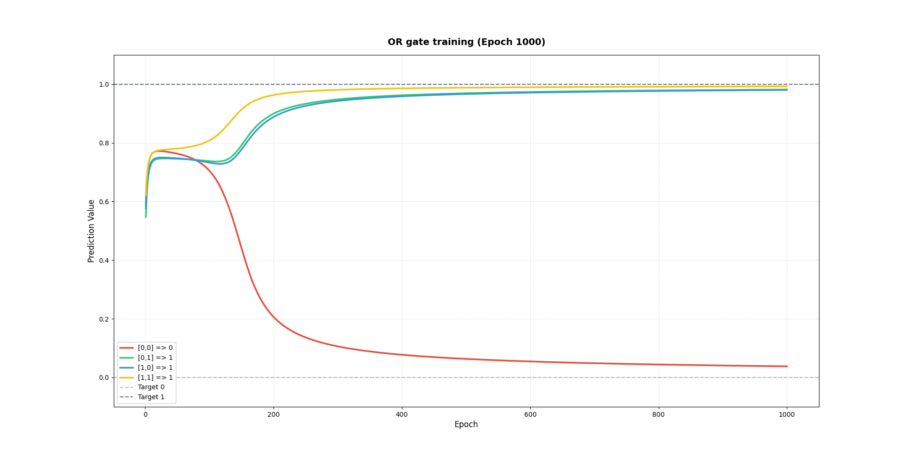
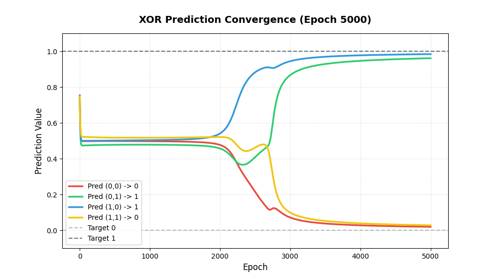

# 🧠 nn — Neural Networks From Scratch

### Because `pip install torch` and calling it a day just wasn't going to cut it.

---

## What Is This?

A **neural network library built entirely from scratch in pure Python** — no NumPy, no PyTorch (for the core), no shortcuts. Just raw math, custom backprop, and the sheer audacity to reinvent the wheel and make it rounder.

This repo is a journey from "what even is a neuron" to "okay I built a CNN" — and it shows. In a good way.

---

## Repo Structure

```
nn/
├── lib/                    # The brain. The real one. Built by hand.
│   ├── neuron.py           # Neuron, NeuralLayer, NeuralNetwork — the whole gang
│   ├── activation.py       # sigmoid, relu, tanh (and their moody derivatives)
│   ├── loss.py             # MSE, gradients, gradient descent
│   └── vectors.py          # Custom vector math. Yes, we wrote dot products ourselves.
│
├── main/                   # Proving grounds
│   ├── and.py              # AND gate. Simple. Classic. Conquered.
│   ├── or.py               # OR gate. Also conquered. Barely broke a sweat.
│   ├── xor.py              # XOR gate. The one that humbled us. 5000 epochs.
│   └── pytorch/            # The sequel arc — same energy, more GPUs
│       ├── fnn/            # Feedforward Neural Network
│       ├── cnn/            # Convolutional Neural Network (with tuning!)
│       ├── rnn/            # Recurrent Neural Network
│       ├── lstm/           # LSTM — Shakespeare text generation
│       └── gru/            # GRU — also Shakespeare, but cooler
│
├── sample/                 # Screenshots of the model actually learning. Proof.
│   ├── AND_gate_training.png
│   ├── OR_gate_training.png
│   └── XOR_Prediction_Live_Convergence.png
│
└── test/
    └── test.py             # One test. It passes. We sleep well.
```

---

## The Core Library (`lib/`)

Built from the ground up. No training wheels.

### `neuron.py` — The Star of the Show

Three classes that do the heavy lifting:

| Class | What It Is | What It Does |
|---|---|---|
| `Neuron` | A single neuron | Forward pass + backprop. The atom of this whole thing. |
| `NeuralLayer` | A layer of neurons | Runs them in parallel, passes outputs forward |
| `NeuralNetwork` | The full network | `add()`, `forward()`, `backward()`, `update()` — the full lifecycle |

```python
nn = NeuralNetwork()
nn.add(NeuralLayer(num_neurons=4, layer_size=2, a_type=sigmoid))
nn.add(NeuralLayer(num_neurons=2, layer_size=4, a_type=sigmoid))
nn.add(NeuralLayer(num_neurons=1, layer_size=2, a_type=sigmoid))
```

Backprop is implemented manually. The error flows backward through every layer like a disappointed parent finding out their child didn't use autograd.

### `activation.py` — Emotions for Neurons

```python
sigmoid(x)           # smooth, classic, a little slow
relu(x)              # fast, aggressive, doesn't care about negatives
tanh(x)              # sigmoid's edgier cousin
# + all their derivatives, for the backward pass
```

### `loss.py` — How Wrong We Are, Quantified

```python
mse(y_pred, y_true)                          # the pain, as a number
compute_gradients(input, y_pred, y_true, z)  # which direction to be less wrong
gradient_descent(weight, gradient, lr=0.01)  # actually getting less wrong
```

### `vectors.py` — Linear Algebra, Handcrafted

Because we didn't trust NumPy with our homework:

```python
dot(v1, v2)          # the dot product, implemented ourselves
mat_mul(m1, m2)      # matrix multiplication, from scratch
add, sub, sv_mul     # the supporting cast
```

---

## The Experiments (`main/`)

### Logic Gates — The Rite of Passage

Every neural network tutorial starts here. We were not above it.

| Gate | Epochs | Learning Rate | Verdict |
|---|---|---|---|
| AND | 1,000 | 1.0 | Trivial. Insulting, even. |
| OR | 1,000 | 1.0 | Done before breakfast. |
| XOR | **5,000** | 0.5 | The humbling. Required a hidden layer and existential reflection. |

All three feature **live matplotlib training visualization** — watch the predictions converge in real time like a slow-motion redemption arc.

### PyTorch Arc — The Glow-Up

After building everything by hand, we graduated to PyTorch for the heavy stuff:

- **FNN** — Feedforward network. The foundation.
- **CNN** (`cnn.ipynb` + `tuned_cnn.ipynb`) — Convolutional network, with a tuned version because first attempts are never the final answer.
- **RNN** — Recurrent network for sequence tasks. Memory, but make it neural.
- **LSTM** — Long Short-Term Memory, trained on Shakespeare's complete works. It generates text. Whether the text makes sense is a philosophical question.
- **GRU** — Like LSTM but lighter. Also trained on Shakespeare. Also questionable output. Equally impressive.

---

## Training Samples

| AND Gate | OR Gate | XOR Convergence |
|---|---|---|
|  |  |  |

---

## Quick Start

```bash
git clone https://github.com/afngh/nn.git
cd nn

# Install the one real dependency
pip install matplotlib

# Run a logic gate
python main/and.py
python main/or.py
python main/xor.py   # grab a coffee, this one's 5000 epochs

# Run the test (it passes, don't worry)
python test/test.py
```

For the PyTorch notebooks, open them in Jupyter or Google Colab.

---

## Dependencies

```
matplotlib   # for the live training graphs
Python 3.x   # obviously
math         # the built-in one. we're old school.
random       # for weight initialization. chaos, controlled.
```

The core library has **zero external dependencies**. That's the whole point.

---

## The Philosophy

This repo exists because reading about backpropagation is one thing. Writing `neuron.error = accumulated_error * neuron.a_deriv(neuron.z)` at 2am while staring at a loss curve that won't go down is something else entirely.

There's no shortcut to understanding. So we didn't take one.

---

> *"First principles. Everything else is just an abstraction on top of what's already here."*
